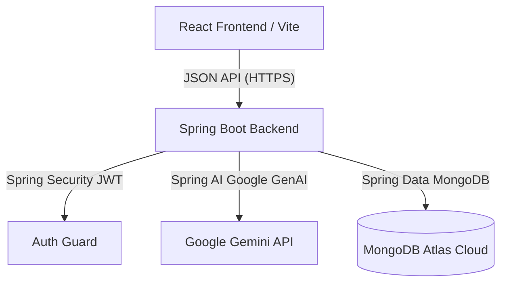

# LeaveTracker MVP — AI-Powered Leave Management System

🌐 **Live Production App**: [leave-request-five.vercel.app](https://leave-request-five.vercel.app/)

LeaveTracker is a modern, enterprise-ready fullstack web application that simplifies corporate leave request creation and management. By utilizing the **Google Gemini AI model**, LeaveTracker automatically generates formal leave application letters based on employee input, evaluates task handover plans, and provides HR managers with a secure dashboard to review, analyze, and resolve leave requests.

---

## 🌟 Core Features

- **AI-Powered Letter Generation**: Instantly drafts official, formatted leave letters based on dates, duration, and reason using Gemini 1.5 Flash.
- **Dual Dashboards**:
  - **Employee Workspace**: Submit leave requests, write handover plans, preview AI letters, and track request statuses.
  - **HR Manager Workspace**: Access a secure portal to review pending requests, read AI-generated letters, leave feedback comments, and approve or reject applications.
- **JWT Security & Role-Based Access Control**: Secure login and sign-up flows with encrypted JWT token authentication to guarantee strict boundary isolation between employees and administrators.
- **Modern Glassmorphic UI**: Beautiful responsive user interface featuring glassmorphism cards, micro-animations, and dynamic light/dark mode styling.

---

## 🏗️ Architecture & Technology Stack



### Frontend (Client)
- **Framework**: React 18 & Vite
- **Styling**: Tailwind CSS
- **Routing**: React Router DOM (v6)
- **API Client**: Axios (with authorization interceptors)
- **Icons**: Lucide React
- **Notifications**: React Hot Toast

### Backend (Server)
- **Framework**: Spring Boot 3.2.5 (Java 17)
- **Database**: MongoDB (Spring Data MongoDB)
- **Security**: Spring Security & JSON Web Tokens (JJWT)
- **AI Engine**: Spring AI Google GenAI Starter
- **Deployment**: Dockerized

---

## 🚀 Getting Started & Local Development

Follow these steps to clone, configure, and run the LeaveTracker project on your local machine.

### Prerequisites
- **Java**: JDK 17 or higher
- **Node.js**: v18 or higher & npm
- **Database**: A local MongoDB instance or a MongoDB Atlas Cloud account

---

### 1. Clone the Repository
```bash
git clone https://github.com/hemanthkumarra/Leave-Request.git
cd Leave-Request
```

---

### 2. Configure Environment Variables

#### Backend (Server)
Create a `.env` file inside the `server/` directory:
```bash
# server/.env

# MongoDB Database Connection String
MONGO_URI=mongodb+srv://<username>:<password>@<cluster-url>.mongodb.net/leave_management

# Secure JWT signing secret (minimum 32 characters)
JWT_SECRET=super_secret_key_that_is_at_least_32_characters_long_for_security_reasons

# Google Gemini API key from Google AI Studio
SPRING_AI_GOOGLE_GENAI_API_KEY=your_gemini_api_key_here
```

#### Frontend (Client)
Create a `.env` file inside the `client/` directory:
```bash
# client/.env
VITE_API_BASE_URL=http://localhost:8080/api
```

---

### 3. Running the Backend Server
Navigate to the `server/` directory and build/start the Spring Boot application:

- **Using your system's Maven**:
  ```bash
  cd server
  mvn spring-boot:run
  ```
- **Using the pre-packaged Maven Wrapper (Windows)**:
  ```bash
  cd server
  ..\maven-temp\apache-maven-3.9.6\bin\mvn.cmd spring-boot:run
  ```

*The backend server will start and bind to **`http://localhost:8080`**.*

---

### 4. Running the Frontend Client
Navigate to the `client/` directory, install dependencies, and launch the Vite development server:
```bash
cd client
npm install
npm run dev
```

*The frontend application will start and be available at **`http://localhost:5173`**.*

---

## 🐳 Docker Deployment & Production Hosting

The Spring Boot backend is equipped with a multi-stage `Dockerfile` to facilitate instant containerization and hosting on platforms like **Render**, **Railway**, or **AWS EC2**.

### Local Docker Build
To compile and package the backend inside a lightweight Alpine container:
```bash
cd server
docker build -t leave-tracker-backend .
docker run -p 8080:8080 --env-file .env leave-tracker-backend
```

### Cloud Production Configurations
- **Database**: Hosted on **MongoDB Atlas** with whitelisted access (`0.0.0.0/0` or Render's outbound IPs).
- **Backend**: Hosted on **Render** using the **Docker** runtime pointing to the `server` root directory.
- **Frontend**: Hosted on **Vercel** configured with the `VITE_API_BASE_URL` pointing to your live Render backend endpoint.
